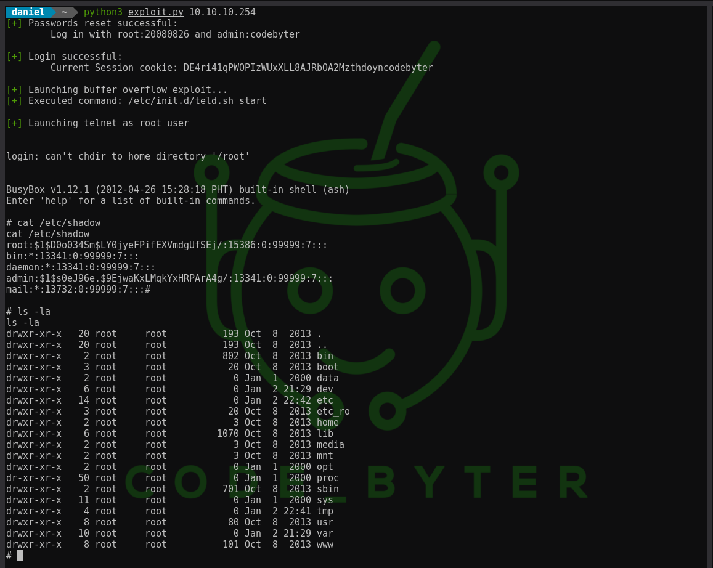

===============
Fantec MWiD25-DS
===============

Writeup for CVE-2022-28113
by @code-byter

==========================

This is a writeup of exploiting the Fantec MWiD25-DS Travel Router (Firmware version: 2.000.030).
This vulnerability allows any unauthorized user to execute arbitrary commands as root user. A vulnerability in the
backup functionality (upload.csp) allows any user to write files and thus reset the user passwords without a valid
session cookie. Using these new credentials the attacker can log into the web interface and exploit a buffer overflow
vulnerability. The SSID parameter of the set wifi client functionality is vulnerable to a heap overflow and allows
the attacker to execute arbitrary terminal commands. The whole exploit is possible without any user input or
required reboot.

CVSS 3.1 Base Score: 9.8
------------------------

Affected file: ``/protocol.csp``

Exploit
=======

The whole exploitation process is automated with a python script. To spawn a root shell run ``exploit.py``.

.. code:: python

  python3 exploit.py 10.10.10.254

.. footer::

    Daniel Schwendner, Email: hello@code-byter.com, Instagram: code_byter

